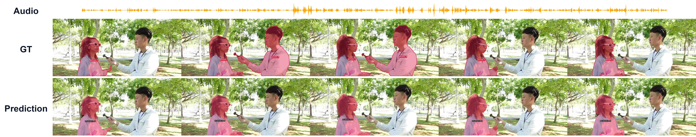
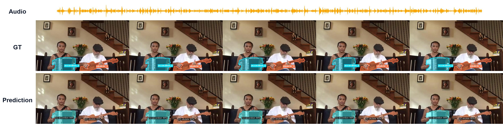

# SAVIS: Audio-Visual Instance Segmentation

[](https://arxiv.org/abs/2603.01431)
[](https://onedrive.live.com/?id=%2Fpersonal%2F3c9af704fb61931d%2FDocuments&viewid=75c49926%2D2803%2D4280%2D994e%2Da8047deca96b&listurl=%2Fpersonal%2F3c9af704fb61931d%2FDocuments&redeem=aHR0cHM6Ly8xZHJ2Lm1zL3UvYy8zYzlhZjcwNGZiNjE5MzFkL0VURERsaVE4elpGR21ZeGxMVlB5aTNzQmlzX2ZkalgwdzhtSmh5UW5ZVlNkWEE%5FZT1XdDdwVWI&ga=1)
[](https://drive.google.com/file/d/13DR2U54zjZwswYSYp4xg1TgsMrxrRbE4/view?usp=sharing)
[](LICENSE)

SAVIS (Audio-Visual Instance Segmentation) is a robust deep learning framework designed for segmenting and tracking sounding objects in video sequences. By leveraging joint audio-visual representations, attention-based fusion, and temporal modeling, SAVIS delivers precise instance-level segmentation masks and tracks them across video timelines.

This repository hosts the core implementation of **SAVIS (SAVISM Research Framework)**.

---

## 🎨 Qualitative Results

Below are qualitative results of SAVIS compared against Ground Truth (GT) on key categories (Speaking and Music), showcasing the audio waveform, ground truth masks, and our predicted segmentations across time:

<details open>
<summary><b>🗣️ Speaking (Human) Category</b></summary>
<br>



</details>

<details open>
<summary><b>🎵 Music Category</b></summary>
<br>



</details>

<details open>
<summary><b>🎥 Demo Video</b></summary>
<br>


</details>

---

## 🛠️ Installation

This guide is optimized for Ubuntu 24.04 and RTX 4080 (CUDA 12.1 + PyTorch 2.1.0).

### 1. Clone the Repository
```bash
git clone https://github.com/Sayyam-Akram/savis.git
cd savis
```

### 2. Setup the Environment
```bash
conda create --name savis python=3.8 -y
conda activate savis

# Install PyTorch
pip install torch==2.1.0 torchvision==0.16.0 --index-url https://download.pytorch.org/whl/cu121

# Install OpenCV, Ninja, and other core dependencies
pip install -U opencv-python ninja
pip install -r requirements.txt
```

### 3. Install Detectron2 from Source
```bash
git clone https://github.com/facebookresearch/detectron2.git
cd detectron2
pip install -e .
cd ..
```

### 4. Compile Deformable Attention Operators
```bash
cd mask2former/modeling/pixel_decoder/ops
sh make.sh
cd ../../../../
```

---

## 💾 Dataset & Model Weights

### Dataset Setup
Download the [AVISeg Dataset](https://onedrive.live.com/?id=%2Fpersonal%2F3c9af704fb61931d%2FDocuments&viewid=75c49926%2D2803%2D4280%2D994e%2Da8047deca96b&listurl=%2Fpersonal%2F3c9af704fb61931d%2FDocuments&redeem=aHR0cHM6Ly8xZHJ2Lm1zL3UvYy8zYzlhZjcwNGZiNjE5MzFkL0VURERsaVE4elpGR21ZeGxMVlB5aTNzQmlzX2ZkalgwdzhtSmh5UW5ZVlNkWEE%5FZT1XdDdwVWI&ga=1) and extract it to the `datasets/` folder:
```bash
mkdir -p datasets
# Unzip AVISeg.zip inside the datasets/ directory
```

### Pretrained Weights
We use the **BEATs** audio backbone and pretrained visual backbones.
1. Download the [Model Weights](https://drive.google.com/file/d/13DR2U54zjZwswYSYp4xg1TgsMrxrRbE4/view?usp=sharing).
2. Download the pretrained backbones/BEATs weight files from [OneDrive](https://onedrive.live.com/?id=%2Fpersonal%2F3c9af704fb61931d%2FDocuments&viewid=75c49926%2D2803%2D4280%2D994e%2Da8047deca96b&listurl=%2Fpersonal%2F3c9af704fb61931d%2FDocuments&redeem=aHR0cHM6Ly8xZHJ2Lm1zL3UvYy8zYzlhZjcwNGZiNjE5MzFkL0VURERsaVE4elpGR21ZeGxMVlB5aTNzQmlzX2ZkalgwdzhtSmh5UW5ZVlNkWEE%5FZT1XdDdwVWI&ga=1).
3. Place them in the correct directories:
```bash
mkdir -p pre_models checkpoints
# Move visual backbone weights to pre_models/
# Move BEATs checkpoint (BEATs_iter3_plus_AS2M.pt) to the root directory
# Move trained model weights (AVISM_R50_IN.pth) to checkpoints/
```

---

## 🚀 Running SAVIS

### Training
To train the model on a single GPU:
```bash
python train_net.py --config-file configs/avism/R50/avism_R50_IN.yaml
```

### Evaluation
To evaluate a trained checkpoint:
```bash
python train_net.py --config-file configs/avism/R50/avism_R50_IN.yaml --eval-only MODEL.WEIGHTS checkpoints/AVISM_R50_IN.pth
```

### Demo Visualization
To generate qualitative results and visualizations for input video sequences:
```bash
python demo_video/demo.py --config-file configs/avism/R50/avism_R50_IN.yaml --opts MODEL.WEIGHTS checkpoints/AVISM_R50_IN.pth
```

---

## 🤝 Acknowledgement

We thank the great work from Detectron2, Mask2Former and VITA. We also highly appreciate the great work from the authors of AVISM (AVIS baseline) on which our framework is built.
