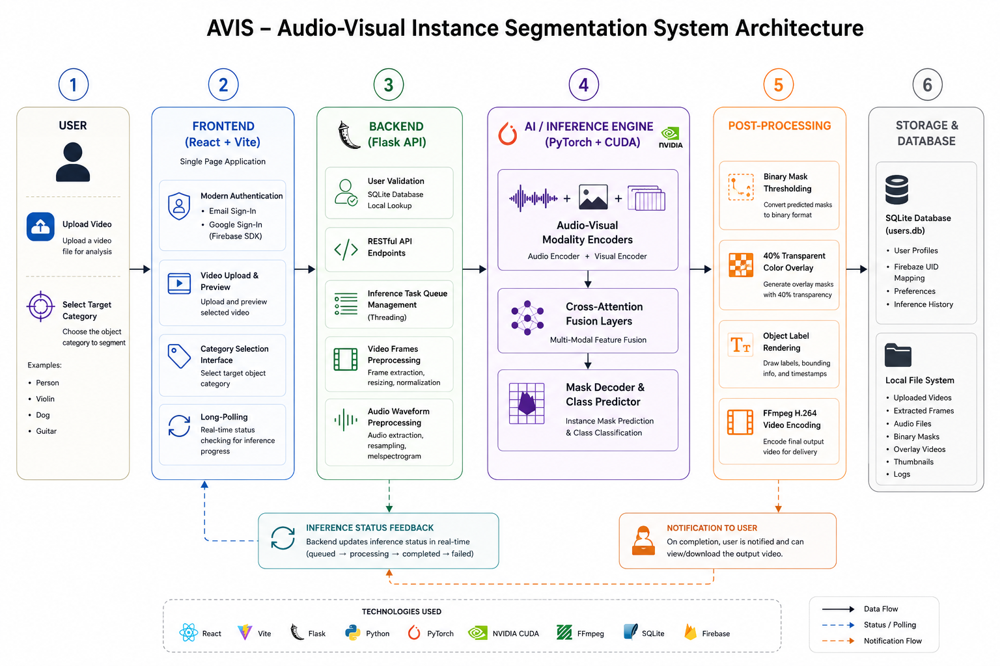
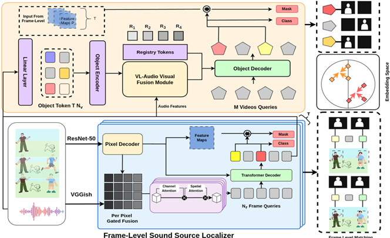

# AVIS — Audio-Visual Instance Segmentation

AVIS (Audio-Visual Instance Segmentation) is a state-of-the-art framework designed for segmenting and tracking sounding objects in video sequences. By leveraging joint audio-visual representations, attention-based fusion, and temporal modeling, AVIS delivers precise instance-level segmentation masks and tracks them across video timelines.

This repository hosts both the core **AVISM Research Framework** and the interactive **AVIS Web Application** (React SPA frontend + Flask API backend).

---

## 🏗️ System & Model Architecture

### 1. Web Application System Architecture
The system architecture coordinates the user input, authentication flow, background queue management, and deep learning model inference.



### 2. Deep Learning Model Architecture
The research model operates on two levels: a Frame-Level Sound Source Localizer and a Video-Level Sounding Object Tracker.



---

## 📊 Performance Metrics

Below is the comparative performance analysis of various fusion methods, attention modules, and architectures on the AVIS benchmark.

### Performance Metrics Table

| Task | Model | Venue | Audio | FSLA | HOTA | mAP | FSLAn | FSLAs | FSLAm | AssA | DetA |
| :---: | :--- | :---: | :---: | :---: | :---: | :---: | :---: | :---: | :---: | :---: | :---: |
| **VIS** | Mask2Former-VIS [11] | CVPR' 22 | ✘ | 29.75 | 52.03 | 28.66 | 0.00 | 25.47 | 36.37 | 64.49 | 43.33 |
| | TeVIT [58] | CVPR' 22 | ✘ | 32.28 | 53.67 | 31.52 | 0.00 | 28.07 | 39.18 | 65.27 | 45.10 |
| | SeqFormer [52] | ECCV' 22 | ✘ | 30.32 | 54.32 | 32.79 | 25.03 | 21.76 | 36.46 | 67.25 | 45.23 |
| | VITA [26] | NeurIPS' 22 | ✘ | 38.04 | 57.48 | 36.25 | 15.04 | 27.98 | 47.45 | 69.86 | 48.96 |
| | DAVIS [60] | ICCV' 23 | ✘ | 23.99 | 49.12 | 19.83 | 14.61 | 24.83 | 24.69 | 63.51 | 40.11 |
| | LBVQ [16] | TCSVT' 24 | ✘ | 34.73 | 56.97 | 36.58 | 27.71 | 29.52 | 38.96 | 68.34 | 48.83 |
| **AVSS** | AVSegFormer [17] | AAAI' 24 | ✔ | 35.66 | 55.74 | 35.72 | 18.58 | 27.51 | 43.08 | 67.13 | 48.51 |
| | COMBO [56] | CVPR' 24 | ✔ | 39.49 | 57.39 | 37.84 | 21.91 | 27.18 | 49.63 | 68.87 | 50.12 |
| **AVIS** | AVISM (Ours) | CVPR' 25 | ✔ | 42.78 | 61.73 | 40.57 | **32.22** | 29.83 | **52.40** | 71.15 | 54.97 |
| | AVISM (BEATs) | - | ✔ | **43.49** | **62.38** | **40.73** | 18.90 | **34.72** | **52.29** | **71.41** | **55.86** |

---

## 🔬 Ablation Study: VGGish vs. BEATs Audio Encoders

A key architectural enhancement in the development of AVIS is the transition of the audio modality feature extractor:

* **VGGish (Baseline)**: Utilizes the legacy **VGGish** audio encoder. While VGGish is lightweight, it struggles with fine-grained temporal audio boundary alignment, resulting in a lower overall FSLA metric.
* **BEATs (Proposed)**: Employs the **BEATs (Bidirectional Encoder representations from Audio Transformers)** encoder (768-dimension output) with frame-level Audio-Guided Contrastive Learning (AGCL) loss.

### Ablation Study Table: VGGish vs. BEATs

| Audio Encoder | FSLA | FSLAn | FSLAs | FSLAm | HOTA | mAP | DetA | AssA |
| :--- | :---: | :---: | :---: | :---: | :---: | :---: | :---: | :---: |
| **VGGish** | 41.78 | **40.28** | 29.63 | 49.70 | 61.92 | **41.80** | 55.28 | 70.89 |
| **BEATs** | **43.49** | 18.90 | **34.72** | **52.29** | **62.38** | 40.73 | **55.86** | **71.41** |

---

## 🛠️ Environment Setup & Installation Guide

This guide is optimized for Ubuntu 24.04 and RTX 4080 (CUDA 12.1 + PyTorch 2.1.0).

### Step 1: Clone the Repository
```bash
cd ~/Documents
git clone https://github.com/Sayyam-Akram/AVIS.git
cd avis
```

### Step 2: Create Conda Environment
```bash
conda create --name avism python=3.8 -y
conda activate avism
```

### Step 3: Install PyTorch (RTX 4080 Compatible)
```bash
pip install torch==2.1.0 torchvision==0.16.0 --index-url https://download.pytorch.org/whl/cu121
```
*Verify that GPU is detected:*
```bash
python -c "import torch; print('GPU:', torch.cuda.get_device_name(0)); print('CUDA:', torch.version.cuda)"
# Expected: GPU: NVIDIA GeForce RTX 4080 | CUDA: 12.1
```

### Step 4: Install OpenCV & Ninja
```bash
pip install -U opencv-python ninja
```

### Step 5: Install Detectron2 from Source
```bash
export TORCH_CUDA_ARCH_LIST="8.9"
export CUDA_HOME=/usr
git clone https://github.com/facebookresearch/detectron2.git
cd detectron2
pip install -e .
cd ..
```

### Step 6: Install Core Dependencies
```bash
pip install -r requirements.txt
```

### Step 7: Compile Deformable Attention CUDA Operators
```bash
export CUDA_HOME=/usr
export TORCH_CUDA_ARCH_LIST="8.9"
cd mask2former/modeling/pixel_decoder/ops
sh make.sh
cd ../../../../
```

### Step 8: Create Asset Folders & Place Pretrained Weights
```bash
mkdir -p datasets pre_models checkpoints
```
* Unzip datasets (`AVISeg.zip`) to `datasets/`.
* Unzip backbone weights (`pre_models.zip`) to `pre_models/`.
* Move the trained checkpoint (`AVISM_R50_IN.pth`) to `checkpoints/`.

---

## 🚀 Running the Web Application

The web application consists of a **React frontend** and a **Flask backend** serving inference on the PyTorch model.

### 1. Run the Flask Backend
```bash
cd webapp/backend
conda activate avism_web
# Ensure .env contains: FIREBASE_API_KEY=AIzaSy.................................
python app.py
```
The server will start on `http://localhost:5000` and load the models onto CUDA.

### 2. Run the Vite Frontend
```bash
cd webapp/frontend
npm install
npm run dev -- --port 3000
```
Open `http://localhost:3000` in your browser. You can now register or sign in with Google or Email/Password, select sample videos, and run the segmentation inference model.

