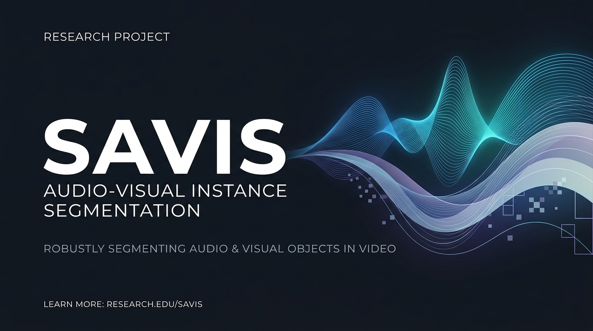

<div align="center">

# SAVIS: Audio-Visual Instance Segmentation



[](https://arxiv.org/abs/2603.01431)
[](https://onedrive.live.com/?id=%2Fpersonal%2F3c9af704fb61931d%2FDocuments&viewid=75c49926%2D2803%2D4280%2D994e%2Da8047deca96b&listurl=%2Fpersonal%2F3c9af704fb61931d%2FDocuments&redeem=aHR0cHM6Ly8xZHJ2Lm1zL3UvYy8zYzlhZjcwNGZiNjE5MzFkL0VURERsaVE4elpGR21ZeGxMVlB5aTNzQmlzX2ZkalgwdzhtSmh5UW5ZVlNkWEE%5FZT1XdDdwVWI&ga=1)
[](https://drive.google.com/file/d/13DR2U54zjZwswYSYp4xg1TgsMrxrRbE4/view?usp=sharing)
[](LICENSE)

*A state-of-the-art framework for segmenting and tracking sounding objects in video sequences.*

---

</div>

### 🎨 Visual Results

Below is the SAVIS framework output showing predicted segmentations vs. Ground Truth (GT) and the audio waveform:

<details open>
<summary><b>🗣️ Speaking (Human) Category</b></summary>
<br>


</details>

<details open>
<summary><b>🎵 Music Category</b></summary>
<br>


</details>

---

### 🚀 Quick Start & Installation

```bash
# Clone the repository
git clone https://github.com/Sayyam-Akram/savis.git && cd savis

# Setup environment
conda create --name savis python=3.8 -y && conda activate savis
pip install torch==2.1.0 torchvision==0.16.0 --index-url https://download.pytorch.org/whl/cu121
pip install -U opencv-python ninja && pip install -r requirements.txt

# Install Detectron2
git clone https://github.com/facebookresearch/detectron2.git && cd detectron2 && pip install -e . && cd ..

# Compile Deformable Attention operators
cd mask2former/modeling/pixel_decoder/ops && sh make.sh && cd ../../../../
```

---

### 💾 Dataset & Weights Setup

1. **AVISeg Dataset**: Download the [AVISeg Dataset](https://onedrive.live.com/?id=%2Fpersonal%2F3c9af704fb61931d%2FDocuments&viewid=75c49926%2D2803%2D4280%2D994e%2Da8047deca96b&listurl=%2Fpersonal%2F3c9af704fb61931d%2FDocuments&redeem=aHR0cHM6Ly8xZHJ2Lm1zL3UvYy8zYzlhZjcwNGZiNjE5MzFkL0VURERsaVE4elpGR21ZeGxMVlB5aTNzQmlzX2ZkalgwdzhtSmh5UW5ZVlNkWEE%5FZT1XdDdwVWI&ga=1) and extract to `datasets/`.
2. **Model Weights**: Download the [Model Weights](https://drive.google.com/file/d/13DR2U54zjZwswYSYp4xg1TgsMrxrRbE4/view?usp=sharing) and pretrained backbones/BEATs weight files from [OneDrive](https://onedrive.live.com/?id=%2Fpersonal%2F3c9af704fb61931d%2FDocuments&viewid=75c49926%2D2803%2D4280%2D994e%2Da8047deca96b&listurl=%2Fpersonal%2F3c9af704fb61931d%2FDocuments&redeem=aHR0cHM6Ly8xZHJ2Lm1zL3UvYy8zYzlhZjcwNGZiNjE5MzFkL0VURERsaVE4elpGR21ZeGxMVlB5aTNzQmlzX2ZkalgwdzhtSmh5UW5ZVlNkWEE%5FZT1XdDdwVWI&ga=1):
   - Place the backbone weights in `pre_models/`.
   - Place the audio encoder checkpoint (`BEATs_iter3_plus_AS2M.pt`) in the root directory.
   - Place the trained model checkpoint (`AVISM_R50_IN.pth`) in `checkpoints/`.

---

### 💻 Usage

* **Train**: `python train_net.py --config-file configs/avism/R50/avism_R50_IN.yaml`
* **Evaluate**: `python train_net.py --config-file configs/avism/R50/avism_R50_IN.yaml --eval-only MODEL.WEIGHTS checkpoints/AVISM_R50_IN.pth`

---

### 🤝 Acknowledgement

We thank the great work from Detectron2, Mask2Former and VITA. We also highly appreciate the great work from the authors of AVISM (AVIS baseline) on which our framework is built.
